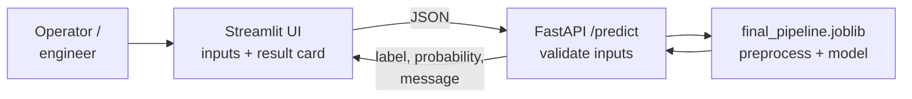

# IT3051 CobotOps — Project Workflow & Team Plan

2026-09-22 · @Someone

## Project at a glance

We are building a protective-stop classifier for the UR3 cobot (UCI CobotOps, 7,409 rows, 3.78% positive) and shipping it as a working prediction app. The work runs through four graded checkpoints in 15 days; everything is due by 6 October.

| Checkpoint | Weight | Type | Date(s) | What is judged |
| --- | --- | --- | --- | --- |
| Proposal + dataset validation | Gate | Group | 20 Sep (done) | Dataset approved |
| Progress Evaluation 1 | 30% | Individual viva | 2026-09-23, 26, 27 Sep | Problem, EDA, data quality, preprocessing, leakage |
| Progress Evaluation 2 | 30% | Individual viva | 2026-09-30, 3, 4 Oct | Algorithms, validation, tuning, final model |
| Technical report + all code | 20% | Group | 2026-10-06 | Whole project, incl. system and testing |
| Final presentation + demo | 20% | Group, marked individually | 2026-10-07, 10, 11 Oct | Business story for non-technical audience + live demo |

**Team:** E.M.Y.E. Meegasthanna (IT23717022), D.R.B.Y. Bandara (IT23779952, technical lead), T.W.M.S.G. Seneviratne (IT23725942), D.R.S. Umer (IT23759916).

The system (backend + frontend) is not a separate graded checkpoint, but it is demonstrated in the presentation and documented in the report, so it must be finished by 6 October too.

## End-to-end workflow

The project is one pipeline in seven phases; each phase ends with a gate that must pass before the next one uses its output.

```mermaid
flowchart LR
  P0["0. Setup<br/>repo + raw data"] --> P1["1. Data understanding<br/>+ EDA"]
  P1 --> P2["2. Temporal + leakage<br/>eligible features"]
  P2 --> P3["3. Preprocessing<br/>+ feature eng."]
  P3 --> E1{{"Eval 1 viva"}}
  E1 --> P4["4. Baseline models<br/>4+ algorithms"]
  P4 --> P5["5. Tuning + final<br/>model selection"]
  P5 --> E2{{"Eval 2 viva"}}
  E2 --> P6["6. Backend + frontend<br/>+ testing"]
  P6 --> P7["7. Report +<br/>presentation"]
```

Read left to right; the report is written alongside every phase, not only at the end.

| Phase | Dates | Output (what the next phase consumes) | Gate to pass |
| --- | --- | --- | --- |
| 0. Setup | 22 Sep | GitHub repo, folder structure, `src/config.py`, raw Excel committed | Everyone can run notebook 01 |
| 1. Data understanding + EDA | 22–23 Sep | Notebooks 01–02, figures in `reports/figures/` | Missingness and class balance confirmed against the proposal |
| 2. Temporal + leakage | 23–24 Sep | Notebook 03, final eligible-feature list, split strategy | Team agrees on the feature list and the task framing (detection vs early warning) |
| 3. Preprocessing + feature engineering | 24–25 Sep | Notebook 04, `src/pipeline.py`, fixed train/test split saved | Pipeline runs end-to-end with no leakage (fit on train only) |
| 4. Baseline models | 27–29 Sep | Notebook 05, shared results table | Same CV folds and metrics for every model |
| 5. Tuning + selection | 29 Sep–2 Oct | Notebooks 06–07, `models/final_pipeline.joblib` | Final model frozen; test set touched once |
| 6. System | 1–5 Oct | `backend/`, `frontend/`, test cases | Demo works end-to-end on a fresh machine |
| 7. Report + presentation | 2–6 Oct (slides to 7 Oct) | Technical report PDF, slides, submission zip | All deliverables in section 6 of the brief are present |

Phase 3 has to be finished before your group's Eval 1 slot. If that slot is 23 September, phases 1–3 compress into today and tomorrow morning, and the depth goes into EDA and leakage first.

## Ownership model: one lane per member

Each member owns one lane that runs through every checkpoint, so their Eval 1 work, Eval 2 model, system part and report sections all tell one connected story in the viva. Everyone still has to understand the whole project, because vivas ask about any stage.

| Member | Lane | Eval 1 | Eval 2 | System | Report |
| --- | --- | --- | --- | --- | --- |
| **Meegasthanna** | Data quality + evaluation | Structure, types, missing values, duplicates, target and class imbalance | Logistic Regression; Dummy baseline; metric framework (why PR-AUC, not accuracy) | Input validation rules + system test cases | Intro, problem, stakeholders, dataset, data understanding |
| **Bandara** (lead) | Time, leakage + validation | Timestamp and cycle analysis, event-window leakage study, split strategy | XGBoost/LightGBM; shared CV harness; cross-model comparison and final selection | Backend API (FastAPI), model loading | Leakage, validation strategy, final selection, system architecture |
| **Seneviratne** | Patterns + interpretation | Distributions, outliers, correlations, class-conditional comparisons, grip\_lost analysis | Random Forest; feature importance, SHAP, feature-selection experiments | Frontend (Streamlit): inputs, result card, explanation | EDA, feature selection, model interpretation |
| **Umer** | Preprocessing + imbalance | Imputation, scaling, encoding, feature engineering, `src/pipeline.py` | SVM (RBF); class weights vs SMOTE; decision-threshold tuning | Final pipeline packaging, prediction messages | Preprocessing, feature engineering, imbalance handling, tuning |

Why this split works for grading:

- **Balanced load.** Each person gets one Eval 1 topic, one model, one system part and three or four report sections.
- **Clear viva answers.** "Explain your contribution" has a single, specific answer per person.
- **Dependencies stay manageable.** Bandara's leakage decision feeds Umer's feature list, and Umer's pipeline feeds everyone's models, so those two handoffs are scheduled first.

Swap names freely. Keep the lanes intact, because they are what make the report sections and viva answers line up.

## Evaluation 1 plan (EDA + preprocessing)

Eval 1 is won or lost on the leakage finding. A first check of the file shows why it matters: at protective-stop rows the median total joint speed is 0.002, against 0.056 at normal rows. Same-row speed readings therefore largely describe a robot that has already stopped.

**Facts from the first check of the file (to be reproduced in the notebooks):**

- 54 rows have missing values, and all 54 are also the rows with a missing target. 46 of them have every sensor missing.
- There are 278 stop rows, grouped into 108 separate episodes (median 2 rows, maximum 12). They occur in 78 of the 240 cycles.
- `grip_lost` overlaps with a stop on only 3 rows (243 grip-loss rows in total), so it is weak as a predictor and a separate event.
- Readings come about once a second, from 08:17 to 15:36 on 26 Oct 2022, with one gap of about 5 hours. Cycles have 11–102 rows (median 25).

### Tasks per member

| Member | Notebook | Must produce | Viva questions to be ready for |
| --- | --- | --- | --- |
| Meegasthanna | 01 Data understanding | Column role table, dtype fixes, missingness heatmap, duplicate check, target balance chart | Why drop the 54 rows? Why is accuracy misleading at 3.78%? |
| Seneviratne | 02 EDA | Distributions by sensor family and class, boxplots + outlier counts, correlation heatmap, grip\_lost cross-tab | Are outliers errors or signal? Which features separate the classes? |
| Bandara | 03 Temporal + leakage | Timeline of stops, ±10-row event-window plots, cycle stats, final eligible-feature list, split decision | What is leakage here and how did you prevent it? Why a group or time split, not a random one? |
| Umer | 04 Preprocessing + FE | `src/pipeline.py` (imputer, scaler, features), saved train/test split, feature-selection results | Why fit only on train? Why median imputation / RobustScaler? Which engineered features and why? |

### Handoffs and schedule

1. **Today, first hour:** Bandara sets up the repo and a shared `load_data()` that strips column names and parses timestamps. Everyone builds on it.
2. **Today:** notebooks 01 and 02 run in parallel. Bandara starts 03, and Umer drafts the pipeline skeleton.
3. **Tomorrow morning:** Bandara gives Umer the eligible-feature list and split decision, and Umer finalises 04.
4. **Tomorrow afternoon:** a 30-minute walkthrough where each person explains their notebook to the others, then a mock viva with swapped questions.

### Decision log (in every notebook)

Every important choice gets a short markdown cell answering four questions: what we decided, what evidence supports it (a figure or number), what alternative we considered, and why we rejected it. These cells are your viva script and later become report paragraphs.

## Evaluation 2 plan (modelling + optimisation)

Each member trains, tunes and defends one model family, and every model runs through the same CV harness so the comparison is fair. The primary metric is PR-AUC. Recall, precision, F1, balanced accuracy and ROC-AUC are reported beside it.

| Member | Model | Tuning focus | Cross-cutting responsibility |
| --- | --- | --- | --- |
| Meegasthanna | Logistic Regression (+ Dummy baseline) | C, penalty, class\_weight | Metric framework; master results table |
| Bandara | XGBoost or LightGBM | n\_estimators, depth, learning\_rate, scale\_pos\_weight | CV harness (StratifiedGroupKFold by cycle); final selection write-up |
| Seneviratne | Random Forest | n\_estimators, max\_depth, min\_samples\_leaf, class\_weight | SHAP / permutation importance; feature-selection ablation |
| Umer | SVM (RBF) | C, gamma, class\_weight | SMOTE vs class weights; decision-threshold tuning |

### Experiment protocol (same for everyone)

1. Load the saved train split and `src/pipeline.py`. Never re-split and never touch the test set.
2. Run the untuned baseline through `evaluate_cv(model)` and log the mean ± std of every metric.
3. Tune with `RandomizedSearchCV` (scoring = `average_precision`, same folds, `random_state=42`), about 30–50 iterations.
4. Log the tuned results in the same table, with a baseline vs tuned comparison.
5. Write two decision-log cells: why this algorithm suits this data, and why it performs better or worse than the others.

### Joint steps

- **29 Sep:** results meeting. Compare all baselines and agree which ablations to run: with and without engineered features, detection vs early warning, class weights vs SMOTE.
- **1 Oct:** choose the final model, weighing PR-AUC, fold stability, interpretability and inference speed. Umer tunes the threshold, then Bandara evaluates once on the test set and saves `models/final_pipeline.joblib`.
- **Before the viva:** each member can explain all four models at a high level and can defend why the chosen one won.

If your Eval 2 slot is 30 September, the final-model steps move to 29 September. Tuning then gets about two days, so keep the search iterations low.

## Individual viva readiness

Both Progress Evaluations are marked per student, and the rubric tests understanding of the **whole project up to that stage** — not just the section each person built. "Ability to explain the student's own contribution" is a separate bullet on top of that, so two things have to be true for everyone going in: you can answer questions on any teammate's part, and you have visible proof of what was yours.

### 1. Prepare against the rubric bullets, not your lane

Build a one-page cheat sheet per evaluation, one short paragraph per official rubric bullet, in your own words:

| Eval 1 rubric bullet | Draws from |
| --- | --- |
| Problem/scenario understanding | Proposal §1 |
| Dataset selection and justification | Proposal §4, §6 |
| Dataset characteristics and target variable | Notebook 01 |
| EDA findings | Notebook 02 decision-log cells |
| Data-quality issues | Notebooks 01–02 |
| Preprocessing techniques and reasons | Notebook 04 decision-log cells |
| Feature engineering/selection decisions | Notebooks 03–04 |
| Data leakage risks and prevention | Notebook 03 |

| Eval 2 rubric bullet | Draws from |
| --- | --- |
| Algorithm selection and justification | Notebook 05, all four models |
| Model comparison and evaluation metrics | Master results table |
| Validation strategy | Notebook 03 split decision |
| Hyperparameter tuning | Notebook 06 |
| Optimization decisions | Notebook 06 decision-log cells |
| Interpretation of results | Notebook 07, SHAP/importance |
| Final model selection and justification | Notebook 07 |

The decision-log cells (see each Evaluation section above) are the raw material — the cheat sheet just re-sorts them by rubric bullet instead of by notebook.

### 2. Rehearse across lanes, not just your own

- Eval 1's mock viva and Eval 2's "explain all four models" step (above) cover this — make sure the questions asked there actually span every rubric bullet, not only each person's own notebook.
- Each member should be able to explain, unprompted, why the team rejected the main alternative at each key decision point (imputation method, split strategy, resampling vs class weights).

### 3. Make contribution visible, not just real

- PR reviews should leave substantive comments (a question, a caught issue, a suggested change) — not just approvals — so the commit/review history is citable evidence for "own contribution," not only a formality.
- Each person's decision-log cells should be committed under their own name, so individual authorship is traceable in the repo, not only known within the team.

## System build (1–5 Oct)

The system is a FastAPI backend that loads `final_pipeline.joblib`, plus a Streamlit frontend. Both are simple to build and demo, and preprocessing can't drift because the backend reuses the saved pipeline.

The user enters sensor readings, or picks a sample row. The backend validates them, runs the saved pipeline, and returns a label, a probability and a plain-language message.

| Part | Owner | Scope | Done when |
| --- | --- | --- | --- |
| Backend API | Bandara | `/predict` and `/health` endpoints, Pydantic input schema, loads the pipeline once at startup | Returns the same prediction as the notebook for 5 test rows |
| Input validation | Meegasthanna | Required fields, numeric types, plausible ranges from the training data, clear error messages | Invalid and missing inputs give a readable error, never a crash |
| Prediction output | Umer | Threshold applied, risk band (low/medium/high), decision-support message with a safety disclaimer | Messages reviewed by the whole team |
| Frontend | Seneviratne | Grouped input form (current / temperature / speed / tool), load-sample button, result card, top-3 feature explanation | A non-technical person can run a prediction without help |
| System testing | Meegasthanna (lead), all | Test table: valid, invalid, missing, boundary and known-positive cases, with expected vs actual results | Test evidence exported for the report |

If the early-warning framing is chosen, the UI accepts a short window of recent readings (for example the last 3–5 rows as CSV) instead of a single row. Settle this on 1 October so the frontend is built only once.

## Technical report (due 6 Oct)

The report follows the brief's 15 required sections in order. Each member drafts the sections from their own lane, using their notebook decision logs, so most of the text already exists by 2 October.

| # | Section (from the brief) | Owner | Source material |
| --- | --- | --- | --- |
| 1 | Introduction and problem definition | Meegasthanna | Proposal §1 |
| 2 | Scenario and stakeholder requirements | Meegasthanna | Proposal §3, §8 |
| 3 | Dataset identification, source, citation, validation | Meegasthanna | Proposal §4, approval evidence |
| 4 | Data understanding and EDA | Seneviratne (+ Meegasthanna for quality) | Notebooks 01–02 |
| 5 | Data cleaning and preprocessing | Umer | Notebook 04 |
| 6 | Feature engineering and selection | Umer + Seneviratne | Notebooks 03–04, ablation results |
| 7 | Algorithms and rationale | All (one paragraph per model) | Notebook 05 decision logs |
| 8 | Model evaluation and comparison | Meegasthanna | Master results table |
| 9 | Hyperparameter tuning and optimisation | Umer (all contribute their model) | Notebook 06 |
| 10 | Final model selection and justification | Bandara | Notebook 07 |
| 11 | System architecture and implementation | Bandara | Backend code, diagram |
| 12 | Backend and frontend development | Bandara + Seneviratne | `backend/`, `frontend/` |
| 13 | System testing and results | Meegasthanna | Test table |
| 14 | Limitations and future improvements | Seneviratne | Leakage, single-robot data, safety scope |
| 15 | Individual contributions | All | Lane table in this plan |

Leakage prevention and validation strategy (Bandara) get their own subsection within section 4 or 6. They are the project's strongest technical point.

**Writing schedule:**

- **By 2 Oct:** drafts of sections 1–6.
- **By 4 Oct:** drafts of sections 7–10.
- **By 5 Oct:** drafts of sections 11–15.
- **5 Oct evening:** Bandara edits the full report for one consistent voice.
- **6 Oct:** proofread and submit.

Keep a shared template with fixed styles for headings, figure captions and reference format.

## Final presentation (7, 10, 11 Oct)

The presentation is aimed at plant managers, not lecturers. It tells a business story: what stops cost, what the data reveals, what the tool does, and what we recommend. Each member presents the part that matches their lane.

| Order | Segment | Speaker | Key message |
| --- | --- | --- | --- |
| 1 | The problem | Meegasthanna | Unplanned protective stops interrupt production; there are 108 stop episodes in one working day of data |
| 2 | What the data shows | Seneviratne | Which sensor patterns go with stops, shown as 2–3 simple visuals |
| 3 | The honest catch | Bandara | Same-moment readings only confirm a stop has already happened, so we built for an early signal instead |
| 4 | The solution + live demo | Seneviratne, then Bandara | Operator enters readings, gets a risk level and a clear message |
| 5 | How reliable it is | Umer | Out of 100 real stops, how many we catch and how many false alarms that costs, in plain numbers |
| 6 | Recommendations + limits | Umer, then Meegasthanna | How to pilot it, what it does not replace (certified safety systems), next steps |

Build the slides from 5 October. Rehearse twice, and prepare a backup demo video in case the live demo fails. Each person should prepare two likely audience questions about their own segment.

## Working agreements

Four rules prevent most group-project failures here: one repo, one data loader, one CV harness, and one daily check-in.

- **Repo layout:** `data/raw` (never edited), `notebooks/01–07`, `src/` (config, features, pipeline, evaluate), `models/`, `backend/`, `frontend/`, `reports/figures/`, `requirements.txt`.
- **Branches:** one per member (for example `eda-seneviratne`), merged through pull requests. Bandara reviews. Commit history doubles as contribution evidence.
- **Reproducibility:** `RANDOM_STATE = 42` everywhere, pinned library versions, and every notebook runs top to bottom with *Restart & Run All* before it is merged.
- **Shared code:** anything two notebooks need (loading, features, pipeline, evaluation) lives in `src/`, never copy-pasted between notebooks.
- **Figures:** saved to `reports/figures/` with numbered names (for example `fig02_missingness.png`), so the report and slides reuse them.
- **Code standard:** PEP 8, docstrings on every `src/` function, and a markdown cell above each code block explaining what it does and why.
- **Daily check-in:** 15 minutes at 9:00 pm, covering what I finished, what I'm blocked on, and what I need from whom.

## Open decisions to confirm as a team

- [ ] Which Eval 1 slot is ours: 23, 26 or 27 September? This sets how compressed the next two days are.
- [ ] Do we have written evidence that the instructor approved the dataset (email, screenshot or sign-off)?
- [ ] Framing: detection only, or detection as a baseline plus early warning (stop within the next k rows)? Decide by 24 Sep, based on notebook 03.
- [ ] Split: StratifiedGroupKFold by cycle, or a chronological split? Decide by 24 Sep, based on notebook 03.
- [ ] Boosting library: XGBoost or LightGBM?
- [ ] Frontend: Streamlit, or a custom HTML/React page if the team wants a more polished demo?
- [ ] Do the lane assignments above suit everyone's strengths?
